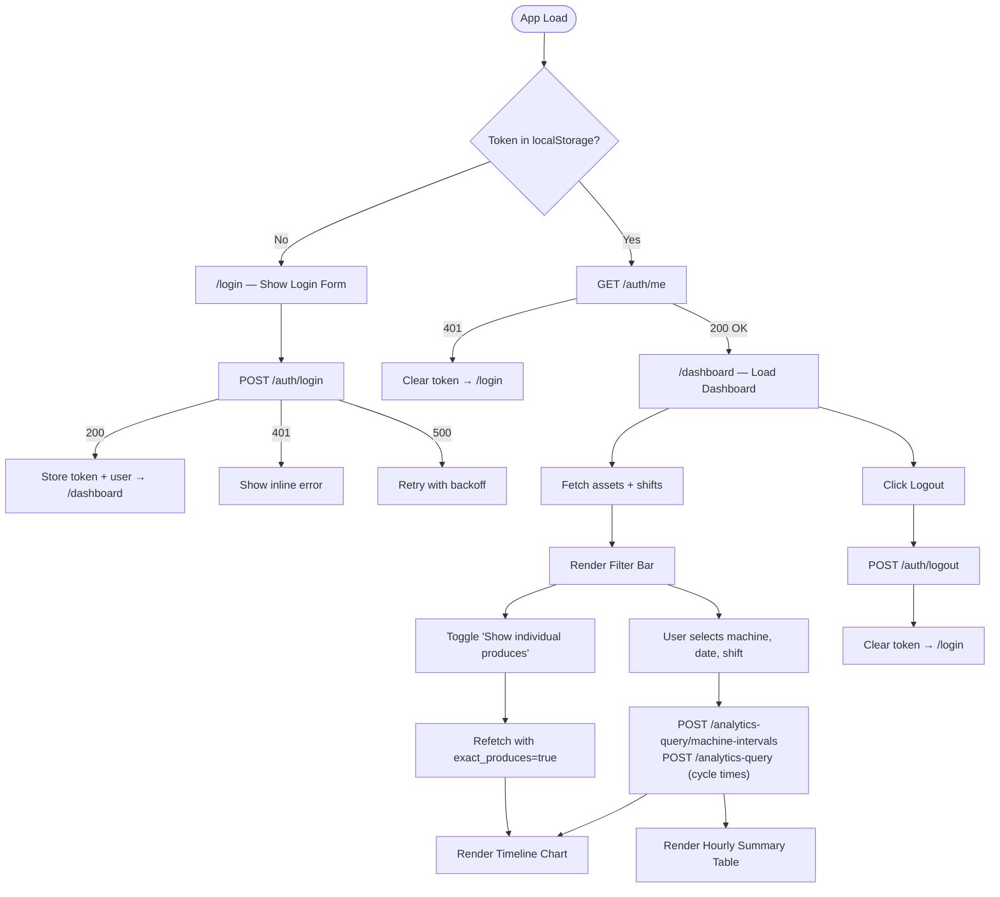

# Application Flow — Manufacturing Timeline Dashboard

## User Journey



## Route Structure

| Route | Component | Auth Required | Description |
|:---|:---|:---|:---|
| `/login` | `LoginPage` | ❌ No | Username/password form |
| `/dashboard` | `DashboardPage` | ✅ Yes | Timeline chart + hourly table |
| `/` | Redirect | — | Redirects to `/dashboard` (or `/login` if unauthenticated) |
| `*` | NotFound | — | 404 catch-all |

## Data Flow

### Authentication Flow
1. User submits credentials → `POST /auth/login`
2. On success: store `access_token` in `localStorage`, set user in `AuthContext`
3. Axios interceptor attaches token to all subsequent requests
4. On any 401 response (except login): clear token, redirect to `/login`

### Dashboard Data Flow
1. On mount: fetch `/core/assets/tree` and `/core/shifts` in parallel
2. User selects machine, date, shift → compute IST shift window → convert to UTC
3. Fire two parallel requests:
   - `POST /analytics-query/machine-intervals` (segments + produce counts)
   - `POST /analytics-query` (cycle-time metrics)
4. Process response:
   - Convert all UTC timestamps to IST
   - Build timeline segments for chart
   - Bucket segments into hourly table rows
   - If "Show individual produces" ON: flatten produces, resolve markers
5. Render chart (Canvas) + table (MUI Table)

### Timezone Conversion Flow
```
User picks: Date=23 Jun 2026, Shift=00:30–12:30 (IST)
→ IST window: 2026-06-23T00:30:00+05:30 to 2026-06-23T12:30:00+05:30
→ UTC window: 2026-06-22T19:00:00Z to 2026-06-23T07:00:00Z
→ Send UTC in request
→ Receive UTC timestamps in response
→ Convert back to IST for display
```
