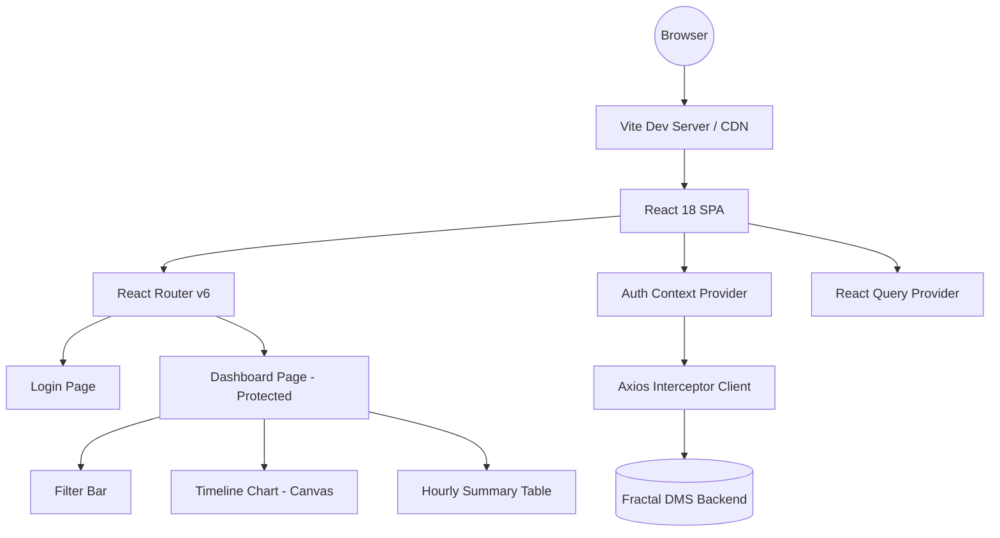

# Technical Requirements Document (TRD) — Manufacturing Timeline Dashboard

## Technical Architecture Overview

This application is a **React 18 SPA** built with Vite (TypeScript) and MUI v6. It uses React Router for client-side routing, React Query for server-state management, React Context for auth state, and a Canvas-based chart renderer for high-performance timeline visualization.



## Technology Stack

| Technology | Role | Version |
|:---|:---|:---|
| **React** | Render Engine | `^18` |
| **TypeScript** | Type Safety | `^5` |
| **Vite** | Build Tool & Dev Server | `^6` |
| **MUI v6** | Component Library (assignment mandated) | `^6` |
| **Emotion** | CSS-in-JS Styling (MUI dependency) | `^11` |
| **React Router** | Client-Side Routing | `^7` |
| **React Query** | Server-State Management | `^5` |
| **Axios** | HTTP Client | `^1` |
| **date-fns** | Date/Time Utilities | `^4` |

## Infrastructure & Environment Variables

The project requires the following environment variable (set in `.env` or `.env.local`):

```bash
# Backend API Base URL (no /api prefix, no trailing slash)
VITE_API_BASE_URL=https://fractaldmsdev.centralindia.cloudapp.azure.com
```

**Deployment Target:** Vercel or Netlify (static SPA export).

## Architecture Decisions

### Auth & Session
- **Token stored in `localStorage`** — persists across page refreshes and browser tabs. Trade-off: XSS exposure vs. UX (justified in `NOTES.md`).
- On app load: read token from `localStorage` → call `GET /auth/me` to validate → if 401, clear token and redirect to `/login`.
- Axios request interceptor attaches `Authorization: Bearer <token>` to all authenticated requests.
- Axios response interceptor catches 401 → clears session → redirects to `/login`.

### State Management
- **React Query** for all API data (assets, shifts, machine intervals, cycle times). Provides caching, refetching, loading/error states, and stale-while-revalidate.
- **React Context** (`AuthContext`) for auth session (token, user, login/logout methods).
- **Component state** for UI-only concerns (filter selections, toggle, zoom range).

### Chart Performance Strategy
- **Canvas-based rendering** for the timeline chart (not SVG DOM) — avoids DOM node explosion with 10k+ markers.
- Pre-compute geometry once on data change (timestamps → pixel positions, colors resolved).
- Downsampling with **FAIL-preserving** algorithm: thin PASS markers at high density, never drop FAIL.
- Memoize computed data with `useMemo` — only recompute when data/zoom changes.
- Zoom via mouse-drag brush selection; double-click to reset.

### Timezone Handling
- Central `@/lib/timezone.ts` module:
  - `toIST(utcDate)` — converts UTC Date to IST-adjusted Date.
  - `toUTC(istDate)` — converts IST Date to UTC for API requests.
  - `buildShiftWindow(date, shiftStartHHMM, shiftEndHHMM)` — builds IST window → returns UTC `from_ts`/`to_ts`.
- All display formatting uses IST-converted dates.
- Hourly bucketing operates on IST clock hours.

### Hourly Table Bucketing
- Segments are already tiled by the backend.
- Convert each segment's `start_at`/`end_at` from UTC to IST.
- Cut segments at IST hour boundaries, accumulating minutes per kind per hour.
- In-progress shifts: only fill buckets up to "now" (IST).

## Error Handling Strategy

| HTTP Code | Behavior |
|:---|:---|
| **401** (on `/auth/login`) | Show inline "invalid credentials" message |
| **401** (on any other call) | Clear token, redirect to `/login` |
| **403** | Show "access denied" message |
| **422** | Show validation error messages from response body |
| **500** | Retry 2x with exponential backoff (1s, 2s), then show error state with retry button |

## Security Controls
- No credentials or tokens committed to version control.
- `.env` is `.gitignore`d.
- Tokens stored client-side with XSS awareness (justified in `NOTES.md`).
